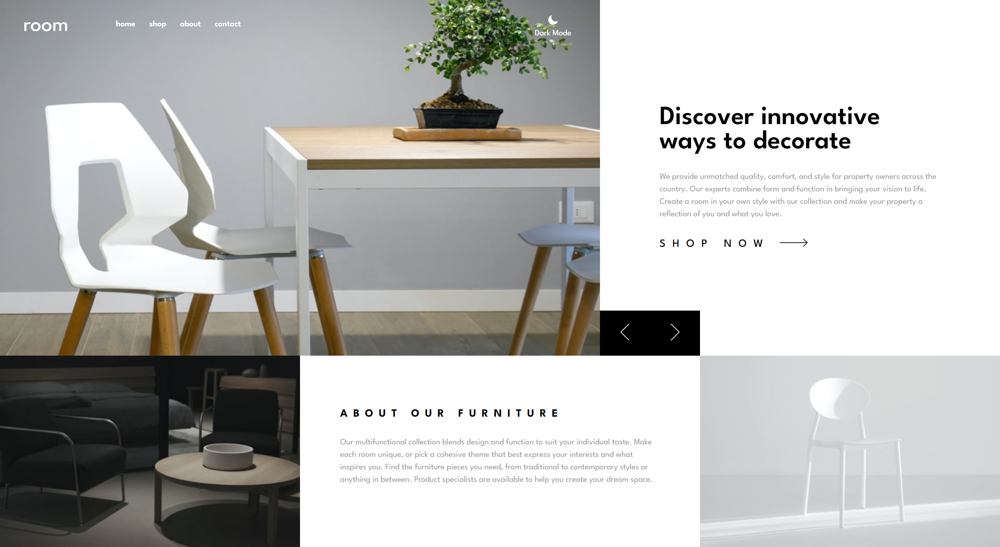
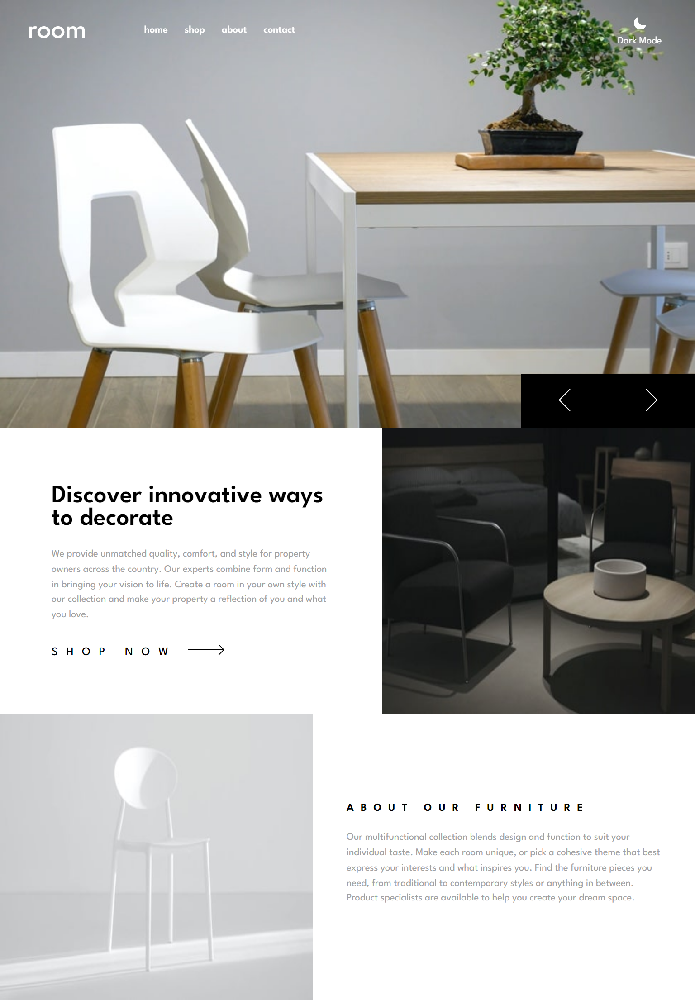
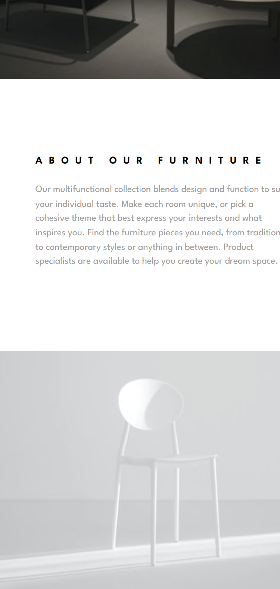
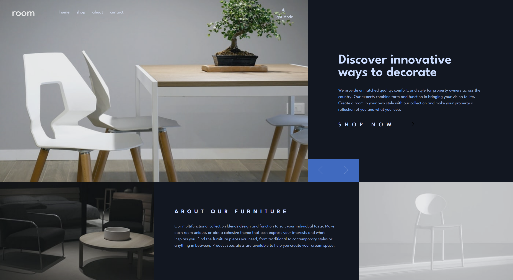
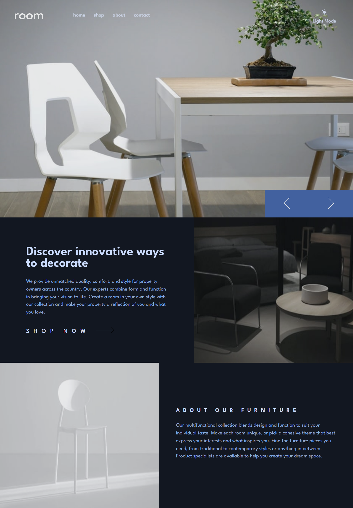
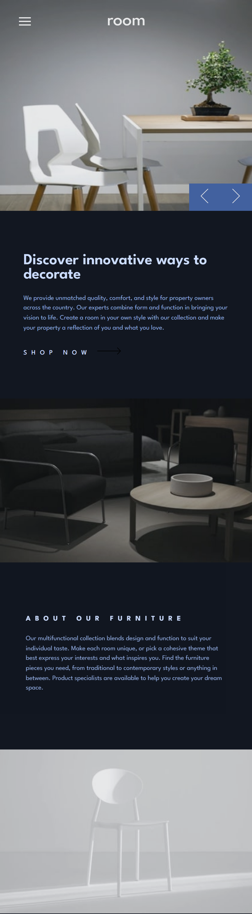

# Frontend Mentor - Room homepage solution

This is a solution to the [Room homepage challenge on Frontend Mentor](https://www.frontendmentor.io/challenges/room-homepage-BtdBY_ENq). Frontend Mentor challenges help you improve your coding skills by building realistic projects.

## Table of contents

- [Overview](#overview)
  - [The challenge](#the-challenge)
  - [Screenshot](#screenshot)
  - [Links](#links)
- [My process](#my-process)
  - [Built with](#built-with)
  - [What I learned](#what-i-learned)
  - [Useful resources](#useful-resources)
- [Author](#author)
- [Acknowledgments](#acknowledgments)

## Overview

### The challenge

Users should be able to:

- View the optimal layout for the site depending on their device's screen size
- See hover states for all interactive elements on the page
- Navigate the slider using either their mouse/trackpad or keyboard

### Screenshot





Additional feature - Dark Mode





### Links

- [Solution Link](https://github.com/MADAkwasi/Frontend-Mentor-Room-Homepage-)
- [Live Site](https://amalitech-training-program.netlify.app/)

## My process

### Built with

- Semantic HTML5 markup
- CSS custom properties
- Flexbox
- CSS Grid
- Desktop-first workflow
- [React](https://reactjs.org/) - JS library
- [Styled Components](https://styled-components.com/) - For styles
- [Animate on Scroll](https://michalsnik.github.io/aos/) - For scrolling animation
- [Context API](https://react.dev/reference/react/createContext) - For global state management

### What I learned

Whiles building the image slider, there was a brief moment where a white screen appears just before the next image could be viewed. This was as a result of the browser loading the image only when the image has been called. The solution was to figure out a way to preload the image so it appears the moment it gets called so there wouldn't be a white screen just before the image appears. Below is the technique I learnt in other to preload the images.

```js
const preloadImages = async () => {
  const preLoaded = await Promise.all(
    imageArr.map((index) => {
      return (
        new Promise() <
        string >
        ((resolve, reject) => {
          const img = new Image();
          img.src = imageArr[index];
          img.onload = () => resolve(img.src);
          img.onerror = reject;
        })
      );
    })
  );
};
```

### Useful resources

- [Stack Overflow](https://stackoverflow.com/questions/9262861/css-background-image-to-fit-width-height-should-auto-scale-in-proportion) - This resource help me with image scaling. The hero images would sometimes not fit the screen for certain device widths. However I was able to adjust the image sizes without losing the aspect-ratio thanks to the solution in this forum.

## Author

- Twitter - [@MADAkwasi](https://www.twitter.com/MADAkwasi)

## Acknowledgments

A hats off to Daniel Akudbilla, he helped me with testing out the final work and gave tips on how to improve the overall performance.
